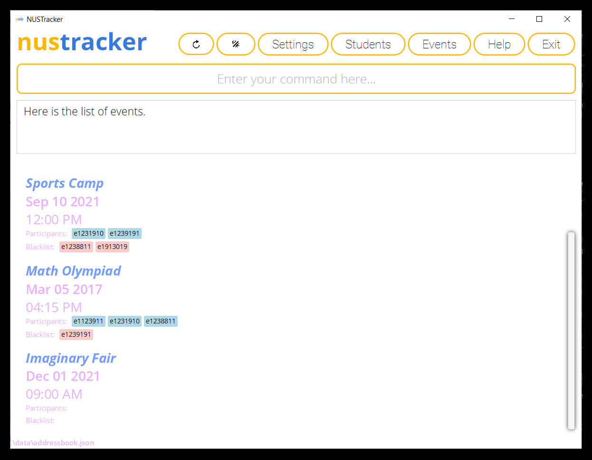

This is the Team Project for CS2103T, done by T11-1.

The code is adapted from **[Address Book](https://se-education.org/addressbook-level3)** which provides a **reasonably
well-written** code base **bigger** (around 6 KLoC) than what students usually write in beginner-level SE modules.

**nustracker** is a desktop application, made for NUS event directors and student leaders of student organizations in NUS School of Computing to:
* keep track
* manage events

that their members are a part of.

 

While it has a GUI, most of the user interactions happen using a CLI (Command Line Interface).

## What nustracker can do:
1. Keep track of students
2. Keep tracks of events and event attendance
3. Keep track of event blacklists
4. Easily export e-mails of a group of students
5. Be customized to the user’s liking

Check out the [**nustracker** website](https://ay2122s1-cs2103t-t11-1.github.io/tp/) to find out more about **nustracker**.

