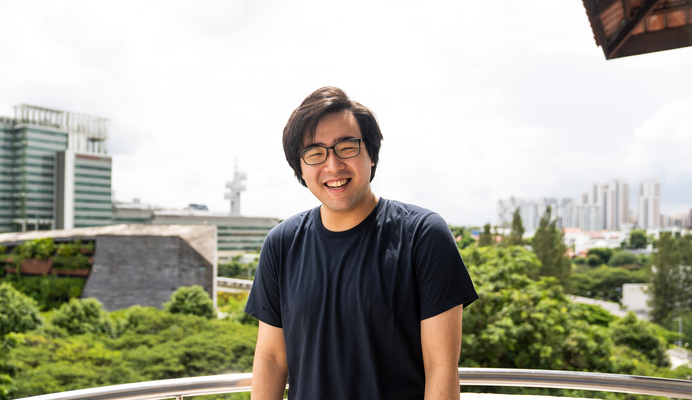

We are a team based in the [School of Computing, National University of Singapore](http://www.comp.nus.edu.sg).

You can reach us through the [team repository](https://github.com/AY2122S1-CS2103T-T11-1/tp).

## Project team

### Siddanth

[[github](https://github.com/wowsiddanth)]
[[portfolio](team/wowsiddanth.md)]

* Role: Code Quality
* Responsibilities: Ensure code is elegant and meets the coding conventions.

### Rehad

[[github](http://github.com/rehad-a)]
[[portfolio](team/rehad-a.md)]

* Role: Testing

### Elvis Teo

[[github](http://github.com/TLChicken)]
[[portfolio](team/tlchicken.md)]

* Role: Scheduling and Tracking
* Responsibilities:

### Joel Sung

[[github](http://github.com/joelsung)]
[[portfolio](team/joelsung.md)]

* Role: Team lead
* Responsibilities: Overall project coordination + Project documentation quality

### Sun Yu Pei

[[github](http://github.com/syoopie)]
[[portfolio](team/syoopie.md)]

* Role: Integration
* Responsibilities: In charge of versioning of the code, maintaining the code repository, integrating various parts of the software to create a whole.

