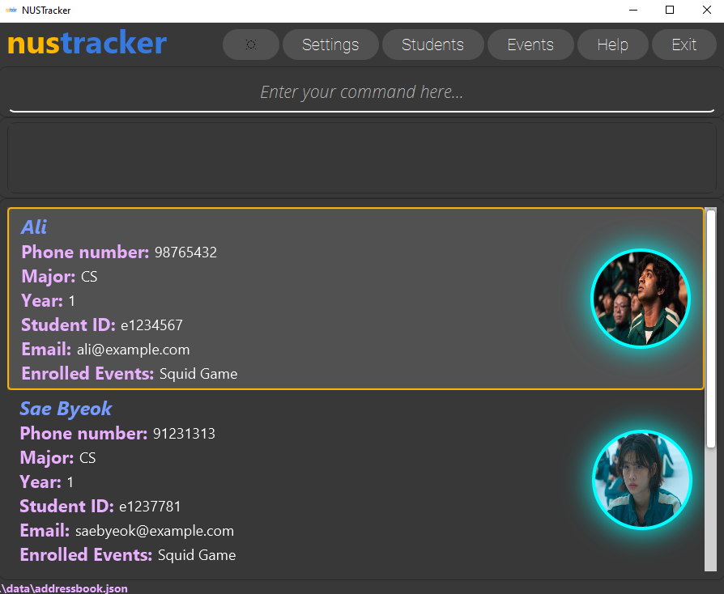

**NUSTracker** is a desktop application for managing large NUS-based student organizations, and is optimized
for use via the CLI or Command Line Interface. Nonetheless, it is supported by a detailed and elegant
Graphical User Interface (GUI).

* Table of Contents
{:toc}

--------------------------------------------------------------------------------------------------------------------

## Quick start

1. Ensure you have `Java 11` or above installed in your Computer.

2. Download the latest `nustracker.jar`, found under Releases

3. Copy the file to the folder you want to use as the _home folder_ for NUSTracker.

4. Double-click the file to start the app. The GUI similar to the below should appear in a few seconds. Note how the app contains some sample data. 
   

5. Type the command in the command box and press Enter to execute it. e.g. typing **`help`** and pressing Enter will open the help window. 
   Some example commands you can try:

   * **`list`** : Lists all students.

   * **`add n/John Doe m/CS id/e1283011 y/2 p/81231293 e/johndoe@example.com`** : Adds a contact named `John Doe` to the Address Book.
   
   * **`exit`** : Exits the app.

6. Refer to the [Features](#features) below for details of each command.

--------------------------------------------------------------------------------------------------------------------

## Features

**:information_source: Notes about the command format:** 

* Words in `UPPER_CASE` are the parameters to be supplied by the user. 
  e.g. in `add n/NAME`, `NAME` is a parameter which can be used as `add n/John Doe`.

* Items in square brackets are optional. 
  e.g `n/NAME [t/TAG]` can be used as `n/John Doe t/friend` or as `n/John Doe`.

* Items with `…`​ after them can be used multiple times including zero times. 
  e.g. `[t/TAG]…​` can be used as ` ` (i.e. 0 times), `t/friend`, `t/friend t/family` etc.

* Parameters can be in any order. 
  e.g. if the command specifies `n/NAME p/PHONE_NUMBER`, `p/PHONE_NUMBER n/NAME` is also acceptable.

* If a parameter is expected only once in the command but you specified it multiple times, only the last occurrence of the parameter will be taken. 
  e.g. if you specify `p/12341234 p/56785678`, only `p/56785678` will be taken.

* Extraneous parameters for commands that do not take in parameters (such as `help`, `list`, `exit` and `clear`) will be ignored. 
  e.g. if the command specifies `help 123`, it will be interpreted as `help`.

  

## Student Commands
### Adding a student: `add`

Adds a student to NUSTracker

Command: `add n/STUDENT_NAME m/MAJOR id/STUDENT_ID y/YEAR p/NUMBER e/EMAIL [ev/EVENT]`

Examples:
* add n/John Doe m/CS id/e1283011 y/2 p/81231293 e/johndoe@example.com

**Formatting**:

- Major are to be specified via acronyms. The following acronyms are valid:
  1. CS (Computer Science)
  2. BZA (Business Analytics)
  3. IS (Information Systems)
  4. ISEC (Information Security)

- The Student ID must be specified exactly. {eXXXXXXX}

- Year must be specified as a single number.

 

### Listing all students: `list`

Shows all students in the app.

Format: `list`

 

### Editing a student : `edit`

Edits an existing student in the address book.

Command: `edit STUDENT_ID [n/NAME] [m/MAJOR] [id/STUDENT_ID] [y/YEAR] [p/PHONE] [e/EMAIL] [ev/EVENT]`

* Edits the student at the specified `STUDENT_ID`.
* At least one of the optional fields must be provided.
* Existing values will be updated to the input values.
* When editing events, the existing events of the student will be removed i.e adding of events is not cumulative.

Examples:
* `edit 1 p/91234567 e/johndoe@example.com` Edits the phone number and email address of the 1st student to be `91234567` and `johndoe@example.com` respectively.
* `edit 2 n/Betsy Crower e/betsycrower@example.com` Edits the name of the 2nd student to be `Betsy Crower` and edits email.

 

### Deleting a student : `delete`

Deletes the specified student.

Command: `delete id/STUDENT_ID`

* Deletes the student with the specified `STUDENT_ID`.

Examples:
* `delete id/e1234567` deletes the student with the Student ID `e1234567`.
* `delete id/0589162` deletes the student with the Student ID `e0589162`.

 

### Filter students: `filter`

Filters students whose data contains the given field.

Command: `filter [id/STUDENT_ID [MORE_STUDENT_IDs]...] [n/STUDENT_NAME [MORE_STUDENT_NAMES]...] [ev/EVENT_NAME]`

* You can filter by:
    - Multiple student IDs. (case-insensitive)
    - Multiple Student names. (case-insensitive)
    - **A single** Event name. (case-sensitive)

* You can only filter by one field (i.e. filter only by student ID, student name, or event name).
* The search is case-insensitive, except for event. e.g. `n/john` will match with `n/JOHN`, but `ev/ifg` will **not** match `ev/IFG`
* Multiple keyword search is only supported for Student ID and Student name.

Examples:
* `filter id/e1234567` returns the student with the ID e1234567 if that student exists in the address book.
* `filter id/e1234567 e2345678` returns two students whose Student IDs are e1234567 and e2345678 if they exist in the address book.
* `filter n/John` returns the students whose names contain John.
* `filter n/John alice` returns the students whose names contain John OR Alice.
* `filter ev/IFG` returns a list of students who are tagged to the IFG event.

_**Coming soon:** Additional fields to filter by._

_**Coming soon:** Filter by multiple fields._

  

## Event Commands

### Creating an event: `create`

Adds an event to NUSTracker

Command: `create n/EVENT_NAME d/EVENT_DATE t/EVENT_TIME`

Examples:
* create n/Orientation Camp d/01-08-2022 t/1000

**Formatting**:

- Event name cannot be empty.

- Event date is in the format `DD-MM-YYYY`.
    - DD represents the day (from 01-31 inclusive)
    - MM represents the month (from 01-12 inclusive)
    - YYYY represents the year

- Event time is in 24 hour time `HHMM`.
    - HH represents the hour (from 00-24 inclusive)
    - MM represents the minute (from 00-59 inclusive)
    - **Note:** if HH is `24`, MM has to be `00`. (`2400`)

 

### List all events : `events`

Shows all events in the app.

Format: `events`

 

### Enroll a student : `enroll`

Enrolls the specified student into the specified event.

Command: `enroll id/STUDENT_ID ev/EVENT`

* Enrolls the student specified by Student ID into the event specified by its event name.

Examples:
* `enroll id/e0544111 ev/CS1101S Mock PE` enrolls the specified student with Student ID e0544111 into the event "CS1101S Mock PE".
* `enroll id/e0322322 ev/Orientation Camp` enrolls the specified student with Student ID e0322322 into the event "Orientation Camp".

 

### Remove a student : `remove`

Removes the specified student from the specified event.

Command: `remove id/STUDENT_ID ev/EVENT`

* Removes the student specified by Student ID from the event specified by its event name.

Examples:
* `remove id/e0986472 ev/Tea Making Workshop` removes the specified student with student ID e0986472 from the event "Tea Making Workshop".
* `remove id/e0264853 ev/Fun Run` removes the specified student with student ID e0264853 into the event "Fun Run".

 

### Deleting an event : `delete`

Deletes the specified event from the address book.

Command: `delete ev/EVENT_NAME`

* Deletes the event with the specified `EVENT_NAME`.

Examples:
* `delete ev/Orientation` deletes the event with the name `Orientation`.
* `delete ev/Sports Camp` deletes the event with the name `Sports Camp`.

  

## Other Commands

### Viewing help : `help`

Shows a message explaining how to access the help page.

Command: `help`

### Exiting the program : `exit`

Exits the program.

Command: `exit`

   

---------------------------------------------------------------------------------------

## Misc
### Saving the data

NUSTracker data is saved in the hard disk automatically after any command that changes the data. There is no need to save manually.

### Editing the data file

NUSTracker data is saved as a JSON file. Advanced users are welcome to update data directly by editing that data file.

_Please edit carefully! NUSTracker will start a fresh run if errors are present!_

--------------------------------------------------------------------------------------------------------------------

## FAQ

**Q**: How do I transfer my data to another Computer? 
**A**: Install the app in the other computer and overwrite the empty data file it creates with the file that contains the data of your previous NUSTracker home folder.

--------------------------------------------------------------------------------------------------------------------

## Command summary

### Student Commands

**Command** | **Description** | **Example** |
----------------------------|------------------------------|-------------------------------------------------------|
**add** | adds a student | `add n/STUDENT_NAME m/MAJOR id/STUDENT_ID y/YEAR p/NUMBER e/EMAIL [ev/EVENT_NAME]` |
**list** | lists students | `list` |
**edit** | edit a student | `edit STUDENT_ID [n/NAME] [m/MAJOR] [id/STUDENT_ID] [y/YEAR] [p/PHONE] [e/EMAIL] [ev/EVENT]` |
**delete** | delete a student | `delete id/STUDENT_ID` |
**filter** | filter by field  | `filter [n/STUDENT_NAME [MORE_STUDENT_NAMES]...]`   `filter [id/STUDENT_ID [MORE_STUDENT_IDS]...]`    `filter [ev/EVENT_NAME]` |

### Event Commands

**Command** | **Description** | **Example** |
---------------------------------------|---------------------------------|---------------------------|
**create**  | create an event | `create n/EVENT_NAME d/EVENT_DATE t/EVENT_TIME` _  Date format: DD-MM-YYYY   Time format: HHHH_ |
**events**  | lists events | `events` **NOT WORKING** |
**enroll**  | adds a student to an event | `enroll id/STUDENT_ID ev/EVENT_NAME` |
**remove**  | removes a student from an event | `remove id/STUDENT_ID ev/EVENT_NAME` |
**delete**  | deletes an event | `delete ev/EVENT_NAME` |

### Other Commands

**Command** | **Description** | **Example** |
-------------------------|------------------------------------------|----------------------------------|
**help** | opens the help window | `help`      |
**exit** | exits the app | `exit` |
