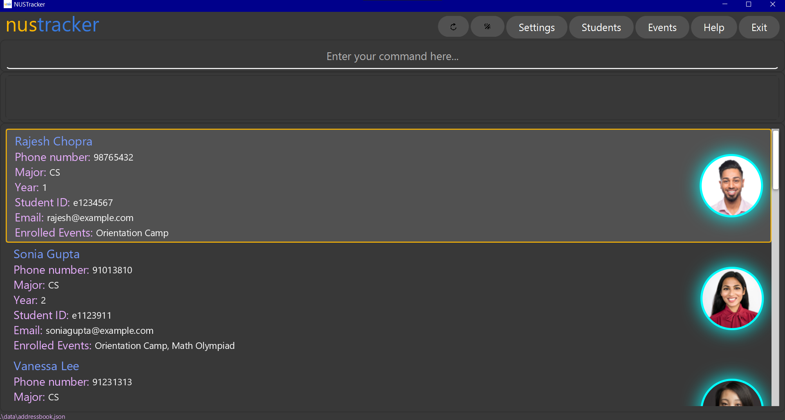

AddressBook Level 3 (AB3) is a **desktop app for managing contacts, optimized for use via a Command Line Interface** (CLI) while still having the benefits of a Graphical User Interface (GUI). If you can type fast, AB3 can get your contact management tasks done faster than traditional GUI apps.

* Table of Contents
{:toc}

--------------------------------------------------------------------------------------------------------------------

## Quick start

1. Ensure you have Java `11` or above installed in your Computer.

1. Download the latest `addressbook.jar` from [here](https://github.com/se-edu/addressbook-level3/releases).

1. Copy the file to the folder you want to use as the _home folder_ for your AddressBook.

1. Double-click the file to start the app. The GUI similar to the below should appear in a few seconds. Note how the app contains some sample data. 
   

1. Type the command in the command box and press Enter to execute it. e.g. typing **`help`** and pressing Enter will open the help window. 
   Some example commands you can try:

   * **`list`** : Lists all contacts.

   * **`add n/John Doe m/CS id/e1283011 y/2 p/81231293 e/johndoe@example.com`** : Adds a contact named `John Doe` to the Address Book.

   * **`delete`**`3` : Deletes the 3rd contact shown in the current list.

   * **`clear`** : Deletes all contacts.

   * **`exit`** : Exits the app.

1. Refer to the [Features](#features) below for details of each command.

--------------------------------------------------------------------------------------------------------------------

## Features

**:information_source: Notes about the command format:** 

* Words in `UPPER_CASE` are the parameters to be supplied by the user. 
  e.g. in `add n/NAME`, `NAME` is a parameter which can be used as `add n/John Doe`.

* Items in square brackets are optional. 
  e.g `n/NAME [t/TAG]` can be used as `n/John Doe t/friend` or as `n/John Doe`.

* Items with `…`​ after them can be used multiple times including zero times. 
  e.g. `[t/TAG]…​` can be used as ` ` (i.e. 0 times), `t/friend`, `t/friend t/family` etc.

* Parameters can be in any order. 
  e.g. if the command specifies `n/NAME p/PHONE_NUMBER`, `p/PHONE_NUMBER n/NAME` is also acceptable.

* If a parameter is expected only once in the command but you specified it multiple times, only the last occurrence of the parameter will be taken. 
  e.g. if you specify `p/12341234 p/56785678`, only `p/56785678` will be taken.

* Extraneous parameters for commands that do not take in parameters (such as `help`, `list`, `exit` and `clear`) will be ignored. 
  e.g. if the command specifies `help 123`, it will be interpreted as `help`.

### Viewing help : `help`

Shows a message explaining how to access the help page.

Command: `help`

### Adding a student: `add`

Adds a student to NUSTracker

Command: `add n/STUDENT_NAME m/MAJOR id/STUDENT_ID y/YEAR p/NUMBER e/EMAIL [ev/EVENT] [t/TAGS]`

Examples:
* add n/John Doe m/CS id/e1283011 y/2 p/81231293 e/johndoe@example.com 

**Formatting**:

- Major are to be specified via acronyms. The following acronyms are valid:
  1. CS (Computer Science)
  2. BZA (Business Analytics)
  3. IS (Information Systems)
  4. ISEC (Information Security)

- The NUS NetID must be specified exactly.
  
    1. e.g e1234567

- Year must be specified as a single number.

_**Coming soon:** Additional field ev/EVENT so the user can directly tag an event to a student._

### Listing all student

Shows a list of all persons in the address book.

Format: `list`

### Filter students by tags: `filter`

Filters students whose data contains the given field.

Command: `filter [id/STUDENT_ID] [ev/EVENT_NAME]`

* You can only filter by one field (i.e. filter only by student id or event name).
* The search is case-insensitive. e.g. `ev/ifg` will match `ev/IFG`

Examples:
* `filter id/e1234567` returns the information of the student with the id e1234567.
* `filter ev/IFG` returns a list of students who are tagged to the IFG event.

_**Coming soon:** Additional fields to filter by._  
_**Coming soon:** Filter by multiple fields._

### Editing a person : `edit`

Edits an existing student in the address book.

Command: `edit INDEX [n/NAME] [m/MAJOR] [id/ NUS NetID] [y/YEAR] [p/PHONE] [e/EMAIL] [ev/EVENT] [t/TAGS]…​`

* Edits the person at the specified `INDEX`. The index refers to the index number shown in the displayed student list. The index **must be a positive integer** 1, 2, 3, …​
* At least one of the optional fields must be provided.
* Existing values will be updated to the input values.
* When editing tags, the existing tags of the person will be removed i.e adding of tags is not cumulative.

Examples:
*  `edit 1 p/91234567 e/johndoe@example.com` Edits the phone number and email address of the 1st person to be `91234567` and `johndoe@example.com` respectively.
*  `edit 2 n/Betsy Crower e/betsycrower@example.com` Edits the name of the 2nd person to be `Betsy Crower` and edits email.

### Locating persons by name: `find`

Finds persons whose names contain any of the given keywords.

Command: `find KEYWORD [MORE_KEYWORDS]`

* The search is case-insensitive. e.g `hans` will match `Hans`
* The order of the keywords does not matter. e.g. `Hans Bo` will match `Bo Hans`
* Only the name is searched.
* Only full words will be matched e.g. `Han` will not match `Hans`
* Persons matching at least one keyword will be returned (i.e. `OR` search).
  e.g. `Hans Bo` will return `Hans Gruber`, `Bo Yang`

Examples:
* `find John` returns `john` and `John Doe`
* `find alex david` returns `Alex Yeoh`, `David Li` 
  

### Deleting a student : `delete`

Deletes the specified student from the address book.

Command: `delete INDEX`

* Deletes the student at the specified `INDEX`.
* The index refers to the index number shown in the displayed student list.
* The index **must be a positive integer** 1, 2, 3, …​

Examples:
* `list` followed by `delete 2` deletes the 2nd student in the address book.
* `find John` followed by `delete 1` deletes the first student in the results of the `find` command.

### Clearing all entries : `clear`

Clears all entries from the address book.

Command: `clear`

### Exiting the program : `exit`

Exits the program.

Command: `exit`

### Saving the data

AddressBook data are saved in the hard disk automatically after any command that changes the data. There is no need to save manually.

### Editing the data file

AddressBook data are saved as a JSON file `[JAR file location]/data/addressbook.json`. Advanced users are welcome to update data directly by editing that data file.

:exclamation: **Caution:**
If your changes to the data file makes its format invalid, AddressBook will discard all data and start with an empty data file at the next run.

### Archiving data files `[coming in v2.0]`

_Details coming soon ..._

--------------------------------------------------------------------------------------------------------------------

## FAQ

**Q**: How do I transfer my data to another Computer? 
**A**: Install the app in the other computer and overwrite the empty data file it creates with the file that contains the data of your previous AddressBook home folder.

--------------------------------------------------------------------------------------------------------------------

## Command summary

Action | Format, Examples
--------|------------------
**Add** | `add n/NAME p/PHONE_NUMBER e/EMAIL a/ADDRESS [t/TAG]…​`   e.g., `add n/James Ho p/22224444 e/jamesho@example.com a/123, Clementi Rd, 1234665 t/friend t/colleague`
**Clear** | `clear`
**Delete** | `delete INDEX`  e.g., `delete 3`
**Edit** | `edit INDEX [n/NAME] [p/PHONE_NUMBER] [e/EMAIL] [a/ADDRESS] [t/TAG]…​`  e.g.,`edit 2 n/James Lee e/jameslee@example.com`
**Find** | `find KEYWORD [MORE_KEYWORDS]`  e.g., `find James Jake`
**List** | `list`
**Help** | `help`
