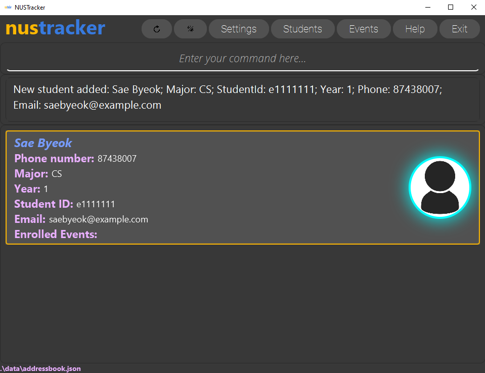
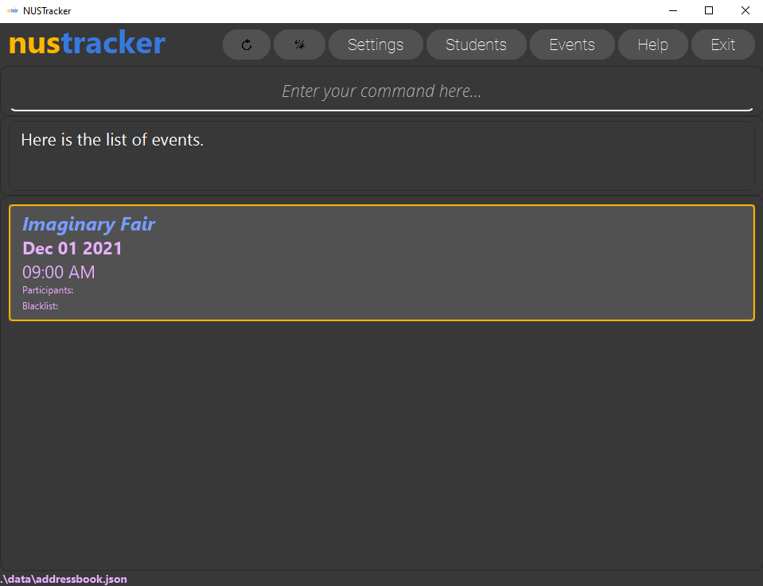
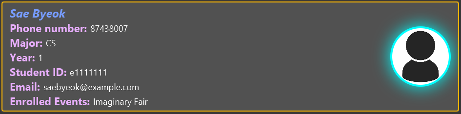
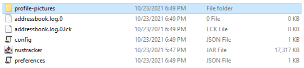

  

**nustracker** is a desktop application for NUS event directors and student leaders of student organizations in NUS School of Computing to manage students and events.

As an event director/student leader, you will be able to add students and events into **nustracker** and use it to keep track of which students are attending which event, and even blacklist students from certain events. These are just some of the features, and there will be even more coming in the future. **nustracker** is also customized to your needs, and is simple, intuitive and easy to pick up.

All these things can be done through a simple and intuitive Command Line Interface (CLI), while being complimented by a detailed and elegant application. This document will guide you through on how to start using **nustracker**.
<h1 align="center"> Let's get started with nustracker!</h1>

  
* Table of Contents
{:toc}

--------------------------------------------------------------------------------------------------------------------
## Getting Started

:exclamation: **Caution:**

**For Mac users**: Please start the jar file via the terminal (See: Opening via Terminal)! If you do not, the files may not be created due to 
current Mac security restrictions on file creation. 

**For Window users**: it is also recommended that the jar be started
via the terminal as well (but double-clicking should work fine).

**You finally have your hands on nustracker. Great! Let's learn how to use it now.**

1. Ensure you have `Java 11` or above installed in your Computer.   

2. Download the latest `nustracker.jar`, found under [Releases](https://github.com/AY2122S1-CS2103T-T11-1/tp/releases).   

3. Copy the `nustracker.jar` to the folder you want to use as the _home folder_ for **nustracker**.   

4. For Windows Users (**Macs users see Step 5!**): 
    1. Double-click the jar file.

5. For Mac Users: 
   1. Open [Terminal](https://support.apple.com/en-sg/guide/terminal/apd5265185d-f365-44cb-8b09-71a064a42125/mac).
   2. Navigate to the home folder created in **Step 3** using the terminal. For example, if your folder was created in Desktop, and is called **nustracker**,
      you would type `cd Desktop/nustracker/` to move to that folder. For more information, check: [_Go to a folder by entering its pathname_.](https://support.apple.com/en-sg/guide/mac-help/mchlp1236/mac)
   3. Type the following command: `java -jar nustracker.jar`. 

6. You should see the following:
   

**nustracker** is now up and running on your system! To getting started, we suggest this flow:
1. [General Layout](#general-layout)
2. [Basics of **nustracker**](#basics-of-**nustracker**)
3. [List of Commands](#student-commands)

_If you are an experienced user, you can jump straight to the [List of Commands](#student-commands)._

Get ready for an unprecedented overhaul in student and event management using **nustracker**!

--------------------------------------------------------------------------------------------------------------------

## Features

**nustracker** was designed to help the average overworked university student, who also has many important responsibilities outside the curriculum
in clubs and societies—specifically **student and event management**.

### What can **nustracker** do?
1. **Keep track of students**

    **nustracker** displays all students currently associated with the organization neatly. The students have their details
   and a profile picture (optional) listed with them as well, allowing quick and convenient access to student particulars.

2. **Keep tracks of events and event _attendance_**

    **nustracker** can also display the events stored, their information, and the participants taking part in those events.

4. **Keep track of event blacklists**
    
    Events often have blacklists, which can also be tracked within **nustracker**.

5. **Be customized to the user's liking**
    
    One of the key points of **nustracker** is its customization. For more information, see [Customization](#customization).

**:information_source: Notes about the command format:** 

* Words in `UPPER_CASE` are the parameters to be supplied by the user. 
  e.g. in `add n/NAME`, `NAME` is a parameter which can be used as `add n/John Doe`.

* Items in square brackets are optional. 
  e.g. `n/NAME [m/MAJOR]` can be used as `n/John Doe m/CS` or as `n/John Doe`.

* Items with `…`​ after them can be used multiple times including zero times. 
  e.g. `[y/YEAR]…​` can be used as ` ` (i.e. 0 times), `y/1`, `y/ 1 2 3` etc.

* Parameters can be in any order. 
  e.g. if the command specifies `n/NAME p/PHONE`, `p/PHONE n/NAME` is also acceptable.

* If a parameter is expected only once in the command, but you specified it multiple times, only the last occurrence of the parameter will be taken. 
  e.g. if you specify `p/12341234 p/56785678`, only `p/56785678` will be taken.

* Extraneous parameters for commands that do not take in parameters (such as `help`, `students`, `events`, `exit` and `clear`) will be ignored. 
  e.g. if the command specifies `help 123`, it will be interpreted as `help`.

--------------------------------------------------------------------------------------------------------------------

## General Layout

The following is a description of the general layout of **nustracker**.

1. **Top bar**
 
    * **Refresh** 
        Refreshes the currently displayed students/events. Press this button when you add profile pictures.

    * **Toggle Theme** 
        Toggles the theme of **nustracker**, from Dark theme to Light theme, and vice versa.

    * **Settings** 
         Opens the Settings Window.
     
    * **Students** 
        Displays current students.

    * **Events** 
        Displays current events.

    * **Help** 
        Opens the Help window.

    * **Exit** 
      Exit **nustracker**.

3. **Command bar**
 
    This space is for the user (you) to type in the commands. For more information about commands, see the section below.
 
4. **Result Display**

    The empty box directly below the command bar is the result display, where error/success messages are displayed.
 
5. **Students**
 
    The students, their information, and the events they are taking part in are displayed here.

--------------------------------------------------------------------------------------------------------------------
## Basics of **nustracker**

The next few section assume that **nustracker** is empty, and that we are adding our first student. When you first open **nustracker**,
you will see sample data. But don't worry, it works regardless! 

We hope you are excited to learn the basics of **nustracker**!
But, before we do anything, let’s set the premise. Imagine that you are the manpower executive of a newly-formed NUS society called the Imaginary Society (very creative we know). 

It plans on holding a fair—appropriately titled the Imaginary Fair—on the 1st of December 2021, at 9am.

Here are the particulars of our first member and participant:   
**Name**: Sae-Byeok   
**Phone number**: 87438007  
**Major**: CS  
**Year**: 1  
**Student ID**: e1111111  
**Email**: saebyeok@example.com  
**Wants to join**: Imaginary Fair

### Adding your first student

Okay, now that we know who our first member is, let's add her to **nustracker**.

To add her, we are going to be using the `add` command, which follows the format:
` add n/STUDENT_NAME m/MAJOR id/STUDENT_ID y/YEAR p/PHONE e/EMAIL`

So, in the case of Sae Byeok, her fields would be:
- `STUDENT_NAME`: Sae Byeok
- `MAJOR`: CS
- `STUDENT_ID`: e1111111
- `YEAR`: 1
- `PHONE`: 87438007
- `EMAIL`: saebyeok@example.com

:bulb: **Tip:**
The fields do not have to be any specific order. So, name can come before major etc.

Using the fields above, type this into the command box: `add n/Sae Byeok Fair m/CS id/e1111111 y/1 p/87438007 e/saebyeok@example.com` and press **Enter**.

After entering the command and pressing **Enter**, **nustracker** should look like this:

Congrats! You have just added your first member! Next, we will learn how to create an event and 
eventually, how to added Sae Byeok as a participant!

### Adding your first event

Let's create the event `Imaginary Fair`.

Intuitively, the command for creating an event is `create n/EVENT_NAME d/EVENT_DATE t/EVENT_TIME`.

So, in the case of Imaginary Fair, it would be:
- `EVENT_NAME`: Imaginary Fair
- `EVENT_DATE (DD-MM-YYYY)`: 01-12-2021
- `EVENT_TIME (24 Hour Time)`: 0900

Using the fields above, type this into the command box: `event n/Imaginary Fair d/01-12-2021 t/0900` and press **Enter**.

To check if it has been created, you can either type `events` into the command box or press the **Events** button in the top bar
(_if you are unsure about the buttons, refer [here](#general-layout)._)

If done right, **nustracker** should look like this:

Congrats! You have now added an event as well!

### Adding your first student to your first event

You have added Sae Byeok as a student, and created the _Imaginary Fair_ event. Let's add her to the event 
itself as a participant.

To do this, we will make use of the `enroll` command:`enroll id/STUDENT_ID ev/EVENT`.

So, in the case of Sae Byeok and the Imaginary Fair, it would be:
- `STUDENT_ID`: e1111111 
- `EVENT`: Imaginary Fair

Using the fields above, type this into the command box: `enroll id/e1111111 ev/Imaginary Fair` and press **Enter**.

If done correctly, this change should be reflected in both Sae Byeok's particulars and the Imaginary Fair's details.

_Under Enrolled Events, Sae Byeok is enrolled in the Imaginary Fair_  

_Under participants, there is a participants with Student ID `e111111` or Sae Byeok_

**Congratulations!** You have made it to the end of this very brief tutorial to adding your first student, creating your
first event, and then adding that student to the event! But remember, **nustracker** is much more powerful that this!

You can:
- Edit the Sae Byeok's details
- Delete events
- Blacklist students
- Export the entire list of students
- Add profile pictures
- And much _much_ more!

For a more comprehensive list of commands, please refer to the sections below or the [Command summary](#command-summary).

You're on your way to becoming an **nustracker** pro!

--------------------------------------------------------------------------------------------------------------------
## Student Commands
### Adding a student: `add`

Adds a student to **nustracker**

Command: `add n/STUDENT_NAME m/MAJOR id/STUDENT_ID y/YEAR p/PHONE e/EMAIL`

Formatting:

- Student name:
  - Does not need to be unique.
  - Can only contain alphanumerical characters and spaces.

- Major is to be specified via acronyms. The following acronyms are valid:
  1. CS (Computer Science)
  2. BZA (Business Analytics)
  3. IS (Information Systems)
  4. ISEC (Information Security)

- Student ID:
  - Must be specified exactly as the letter e, followed by 7 numbers. (eXXXXXXX)
  - Must be unique

- Year must be a number from 1 to 6 inclusive.
- Phone must be unique.
- Email:
  - Must be unique
  - Must be in the `local-part@domain` format
  - `local-part`:
    - Should only contain alphanumeric characters and these special characters: `+ _ . -`
    - The special characters cannot be used consecutively
    - Cannot be blank
  - `domain`:
    - Made up of domain labels separated by periods 
    - Must end with a domain label at least 2 characters long
    - Starts and ends with alphanumeric characters
    - Consists of alphanumeric characters, separated only by hyphens, if any
  - Examples of valid emails:
    - `PeterJack_1190@example.com`
    - `a@bc`
    - `peter_jack@very-very-very-long-example.com`
    - `if.you.dream.it_you.can.do.it@example.com`
    - `a1+be.d@example1.com`

Examples:
* `add n/John Doe m/CS id/e7474831 y/2 p/81631293 e/JohnDoe99@example.com`
* `add n/Melissa Chong m/ISEC id/e3434827 y/5 p/90025837 e/MelissaChongxx@example.com`

### Listing all students: `students`

Shows all students in **nustracker**.

This command essentially removes any filters that have been applied with the `filter` command.

Command: `students`

### Editing a student : `edit`

Edits an existing student in **nustracker**.

Command: `edit id/ID_OF_STUDENT_TO_EDIT [n/NEW_NAME] [m/NEW_MAJOR] [id/NEW_STUDENT_ID] [y/NEW_YEAR] [p/NEW_PHONE] [e/NEW_EMAIL]`

* Edits the student who currently has the specified `STUDENT_ID`.
* **At least one of the optional fields** must be provided.
* Existing values will be updated to the input values.
* Events of a student cannot be directly edited with the `edit` command, the `enroll` and `remove` commands serve this purpose.

Examples:
* `edit id/e0322322 p/91234567 e/johndoe@example.com` Edits the phone number and email of the student with student ID `e0322322` to be `91234567` and `johndoe@example.com` respectively.
* `edit id/e0542341 n/Betsy Crower id/e0543212` Edits the name and student ID of the student with student ID `e0542341` to be `Betsy Crower` and `e0543212` respectively.
 
### Deleting a student : `delete`

Deletes the specified student from **nustracker**.

Command: `delete id/STUDENT_ID`

* Deletes the student with the specified `STUDENT_ID`.

Examples:
* `delete id/e1234567` deletes the student with the student ID `e1234567`.
* `delete id/e0589162` deletes the student with the student ID `e0589162`.

### Filtering students: `filter`

Filters students whose data contains the given field, the search is case-insensitive.

Command: `filter [id/STUDENT_ID [MORE_STUDENT_IDs]...] [n/STUDENT_NAME [MORE_STUDENT_NAMES]...] [m/MAJOR [MORE_MAJORS]...] [y/YEAR [MORE_YEARS]...] [ev/EVENT_NAME]`

* You can filter by:
    - Multiple student IDs.
    - Multiple student names.
    - Multiple majors.
    - Multiple years.
    - **A single** event name.

* You can only filter by one field (i.e. filter only by student ID, student name, year, major, or event name).
* You have to filter by at least 1 parameter (simply typing `filter` will not work)
* The search is case-insensitive. e.g. `n/john` will match with `n/JOHN`.
* You can search using multiple keywords except for events.
* You can search by partial keywords for names and student IDs. e.g. `n/al` will match with `n/alice` and `id/e12` will match with `id/e1234567`

Examples:
* `filter id/e1234567` returns the student with the ID e1234567 if that student exists in **nustracker**.
* `filter id/e1234567 e2345678` returns two students whose student IDs are e1234567 and e2345678 if they exist in **nustracker**.
* `filter id/e09` returns all students with student IDs that contain e09.
* `filter n/John` returns the students whose names contain John.
* `filter n/John alice` returns the students whose names contain John OR Alice.
* `filter m/CS IS` returns the students majoring in CS or IS.
* `filter y/1 2 3` returns the students in years 1, 2, or 3.
* `filter ev/orientation` returns a list of students who are tagged to the Orientation event.

_**Coming soon:** Additional fields to filter by._

_**Coming soon:** Filter by multiple fields._

### Delete shown students : `delfiltered`

Mass deletes all students currently shown in the student list. This is typically used after a filter
command to delete students based on a certain criteria.

Command: `delfiltered`

* This command can only be used when **nustracker** is showing the Student list.
* Use with caution! If the student list is not filtered before using `delfiltered`, all the students currently in
  **nustracker** would be deleted since all of them are shown.
* After all the filtered students are deleted, the remaining students would then all be shown in the list, if any.
* At least one student needs to be shown in the filtered list for `delfiltered` to work.

Examples:
* `filter y/4` followed by `delfiltered` will delete all students who are in Year 4, possibly because they are graduating soon.
* `filter ev/Graduation 2021` followed by `delfiltered` will delete all students that have attended the Graduation Ceremony in 2021.

### Blacklisting students: `blacklist`

Blacklists students from the given event by student ID. Blacklisted student IDs will not be allowed to enroll into the event.

Command: `blacklist id/STUDENT_ID ev/EVENT_NAME`

* Student ID need not exist in the database.
* Event name has to exist in the database.

Examples:
* `blacklist id/e1234567 ev/Orientation Camp` blacklists the student ID e1234567 from the Orientation Camp event.
* `blacklist id/e0000000 ev/Sports Camp` blacklists the student ID e0000000 from the Sports Camp event.
 
### Whitelisting students: `whitelist`

Whitelists students from the given event by student ID. Whitelisted student IDs are removed from the event's blacklist.

Command: `whitelist id/STUDENT_ID ev/EVENT_NAME`

* Student ID needs to be in the event's blacklist.
* Event name has to exist in the database.

Examples:
* `whitelist id/e1234567 ev/Orientation Camp` removes the student ID e1234567 from the Orientation Camp event's blacklist.
* `whitelist id/e0000000 ev/Sports Camp` removes the student ID e0000000 from the Sports Camp event's blacklist.

--------------------------------------------------------------------------------------------------------------------
## Event Commands
### Creating an event: `create`

Adds an event to **nustracker**

Command: `create n/EVENT_NAME d/EVENT_DATE t/EVENT_TIME`

- Event name cannot be empty.

- Event date has to be in the format `DD-MM-YYYY`.
    - DD represents the day (from 01-31 inclusive)
      - A day will not be accepted if the month does not contain it.
      - For example, February does not have a 29th day (unless it is a leap year) so `29-02-2021` will not be accepted.
    - MM represents the month (from 01-12 inclusive)
    - YYYY represents the year.

- Event time has to be in 24 hour time `HHMM`.
    - HH represents the hour (from 00-24 inclusive)
    - MM represents the minute (from 00-59 inclusive)
    - **Note:** if HH is `24`, MM has to be `00`. (i.e. `2400`)
    
Examples:
* `create n/Orientation Camp d/01-08-2022 t/1000` creates an event with the name Orientation Camp, date 01-08-2022 or 1 August 2022, and time 1000 hrs or 10:00 am.

### Listing all events : `events`

Shows all events in the app.

Format: `events`

### Enrolling a student : `enroll`

Enrolls the specified student into the specified event.

Command: `enroll id/STUDENT_ID ev/EVENT`

* Enrolls the student specified by student ID into the event specified by its event name.

* Event name is case-insensitive.

Examples:
* `enroll id/e0544111 ev/CS1101S Mock PE` enrolls the specified student with student ID e0544111 into the event "CS1101S Mock PE".
* `enroll id/e0322322 ev/Orientation Camp` enrolls the specified student with student ID e0322322 into the event "Orientation Camp".

### Removing a student : `remove`

Removes the specified student from the specified event.

Command: `remove id/STUDENT_ID ev/EVENT`

* Removes the student specified by student ID from the event specified by its event name.

* Event name is case-insensitive.

Examples:
* `remove id/e0986472 ev/Tea Making Workshop` removes the specified student with student ID e0986472 from the event "Tea Making Workshop".
* `remove id/e0264853 ev/Fun Run` removes the specified student with student ID e0264853 into the event "Fun Run".

### Deleting an event : `delete`

Deletes the specified event from **nustracker**.

Command: `delete ev/EVENT_NAME`

* Deletes the event with the specified `EVENT_NAME`.

Examples:
* `delete ev/Orientation` deletes the event with the name `Orientation`.
* `delete ev/Sports Camp` deletes the event with the name `Sports Camp`.
--------------------------------------------------------------------------------------------------------------------
## Other Commands

### Viewing help : `help`

Opens the Help window

Command: `help`

### Viewing the settings: `settings`

Opens the Settings window

Command: `settings`

### Exporting Emails : `export`

Exports the emails of the students that are currently being displayed.

Command: `export fn/FILE_NAME`

- Filenames cannot contain these illegal characters:
`\ : * ? " < > | `
- Filenames cannot exceed 50 characters.

The file will be located in the `data` directory, which is where the app's save files are located.

If the "events" page is currently being shown, export will still function and will export the emails of the most recent student list.

If you are exporting with a filename that already exists, the file will be overwritten!

Examples:
* `export fn/StudentsAttendingOrientation`
* `export fn/AllStudents`

### Refreshing the main window: `refresh`

Refreshes the main window. Often used to update the main window after adding profile pictures, etc.

### Changing the theme: `theme`

Toggles the theme between Dark and Light theme.

### Exiting the program : `exit`

Exits the program.

Command: `exit`

---------------------------------------------------------------------------------------
## Customization

Another key feature of **nustracker** is its ability to be customized greatly. This section covers how **nustracker** can be
customized to your liking.

### Changing between Light/Dark Theme
**nustracker** has a light/dark theme. To toggle between the two, either type `refresh` or click the button (to the left of **Settings**) as shown in the image below and voila!
 

### Setting a profile picture
**nustracker** has the ability to add a profile picture to a student. Follow the steps given to add a picture:

1. If you have not started **nustracker** before, run **nustracker** within a folder of your choice.

2. Once it runs, a folder called _**profile-pictures**_ is created within the folder that contains **nustracker**.

    

    *The **profile-pictures** folder is highlighted in blue*

 

3. Open the _**profile-pictures**_ folder and add the image you want as a profile picture. The image must be either a **.png** or a **.jpg** image.

4. 

   1. Rename the image to correspond to the **Student ID** of the student in **nustracker** that will use this profile picture.

       For example, let's say there is a student in **nustracker** with the Student ID **e1111111**.

      
 
      

      *The updated student card (belonging to student with Student ID **e1111111** in **nustracker**)*
        
   3. The profile picture will update once you **type `refresh` into the command box, click the Refresh button, or restart **nustracker****.
   4. You're done!

### Changing the _glow_ of the profile picture border

**nustracker** allows you to change the color of the glow of the profile picture.

1. Open up the **Settings** window either by clicking the **Settings** button or by typing in `settings` into the command box.
 

2. Click the dropdown menu, and pick a color. You can pick a custom color as well.   

   

    *You can choose one of the pre-selected colors.* 

4. This change is **immediate**, and does not require a restart.
 

:bulb: **Tip:**
Although most image sizes will work perfectly fine, the best image sizes are 120px by 120px.

### 4. Customization FAQs
 
**Q**: I have added the image, but it doesn't appear.  

**A**:
* Please check if the image is either **.jpg** or **.png**. Other image types are NOT supported. 
* Please check if you have the correct name format used—refer to [Setting a profile picture](#setting-a-profile-picture) point 3 above. 
* Please check if the image size is too small or too large. Due to the limitations of JavaFX, extreme image sizes cannot be displayed (more than 10 mb). 

If you have
exhausted all options, you can file a bug report on our [GitHub page](https://github.com/AY2122S1-CS2103T-T11-1/tp/issues).
 

You have now learnt to customize **nustracker** to its fullest. Go ahead and play around with the settings!
    

---------------------------------------------------------------------------------------
## Misc
### Saving the data

**nustracker** data is saved in the hard disk automatically after executing any command that changes the data. There is no need to save manually.

The file is saved in a folder where you ran the application. If you ran the application in `C:\Users\JohnDoe`, the data file will be in `C:\Users\JohnDoe\data` and is named `addressbook.json`

### Editing the data file

**nustracker** data is saved as a JSON file. Advanced users are welcome to update data directly by editing that data file.

_Please edit carefully! **nustracker** will start a fresh run if errors are present!_

--------------------------------------------------------------------------------------------------------------------

## FAQ

**Q**: How do I transfer my data to another Computer? 
**A**: Install the app in the other computer and overwrite the empty data file it creates with the file that contains the data of your previous **nustracker** home folder.

**Q**: I noticed a bug in **nustracker**. How do I report it? 
**A**: We are committed to delivering well-made software and to achieve that, every single bug report counts. To submit a
bug report, please visit the **Issues** page [here](https://github.com/AY2122S1-CS2103T-T11-1/tp/issues). Thank you for contributing to **nustracker**!

--------------------------------------------------------------------------------------------------------------------

## Command summary

### Student Commands

**Command** | **Description** | **Example** |
----------------------------|------------------------------|-------------------------------------------------------|
**add** | Adds a student | `add n/STUDENT_NAME m/MAJOR id/STUDENT_ID y/YEAR p/PHONE e/EMAIL` |
**students** | Lists students | `students` |
**edit** | Edits a student | `edit id/ID_OF_STUDENT_TO_EDIT [n/NEW_NAME] [m/NEW_MAJOR] [id/NEW_STUDENT_ID] [y/NEW_YEAR] [p/NEW_PHONE] [e/NEW_EMAIL]` |
**delete** | Deletes a student | `delete id/STUDENT_ID` |
**filter** | Filters by field  | `filter n/STUDENT_NAME [MORE_STUDENT_NAMES]...`   `filter id/STUDENT_ID [MORE_STUDENT_IDS]...`   `filter m/MAJOR [MORE_MAJORS]...`   `filter y/YEAR [MORE_YEARS]...`   `filter ev/EVENT_NAME` |
**delfiltered** | mass deletes shown students | `delfiltered` |
**blacklist** | Blacklists a student from attending an event | `blacklist id/STUDENT_ID ev/EVENT_NAME` |
**whitelist** | Whitelists a student from attending an event | `whitelist id/STUDENT_ID ev/EVENT_NAME` |

### Event Commands

**Command** | **Description** | **Example** |
----------------|-------------------------|-----------------|
**create**  | Creates an event | `create n/EVENT_NAME d/EVENT_DATE t/EVENT_TIME` _  Date format: DD-MM-YYYY   Time format: HHMM_ |
**events**  | Lists events | `events` |
**enroll**  | Adds a student to an event | `enroll id/STUDENT_ID ev/EVENT_NAME` |
**remove**  | Removes a student from an event | `remove id/STUDENT_ID ev/EVENT_NAME` |
**delete**  | Deletes an event | `delete ev/EVENT_NAME` |

### Other Commands

**Command** | **Description** | **Example** |
----------------|-------------------------|-----------------|
**help** | Opens the help window | `help` |
**settings** | Opens the settings window | `settings`|
**export** | Exports the emails of the students that are currently displayed | `export fn/FILE_NAME` |
**refresh**| Refresh the main window | `refresh` |
**theme** | Toggles the current theme | `theme` |
**exit** | Exits the app | `exit` |
