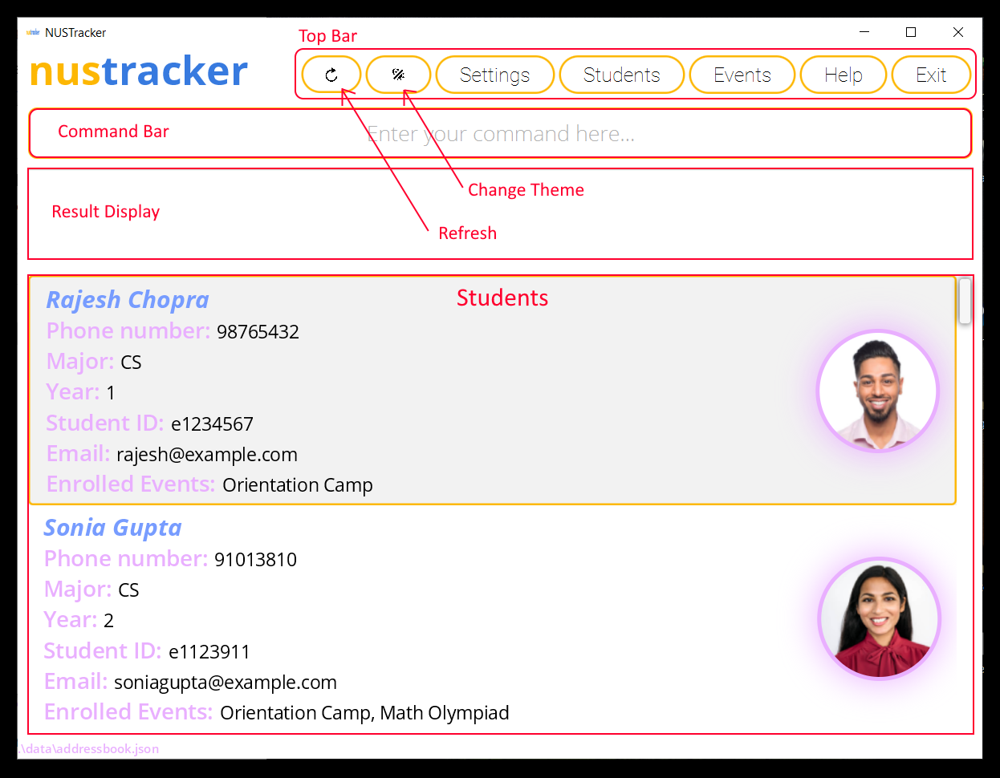
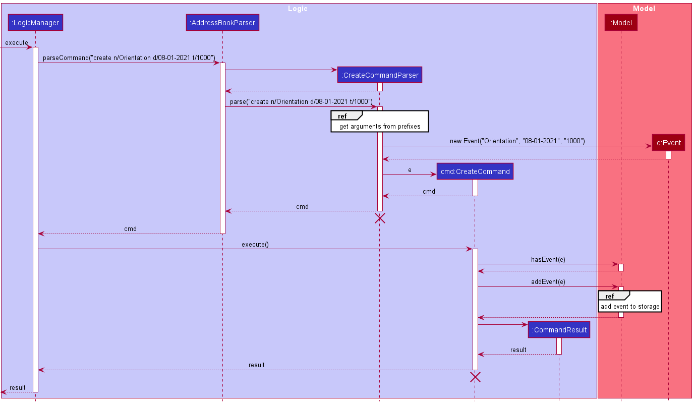
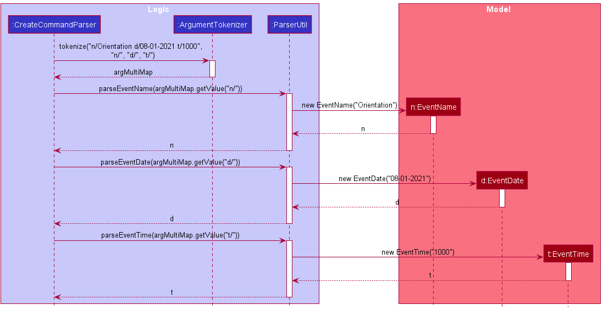
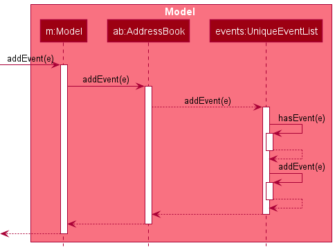

### Project: nustracker

**nustracker** is a desktop application for NUS event directors and student leaders of student organizations in NUS School of Computing to manage students and events.

Given below are my contributions to the project.

* [Link to code contributed](https://nus-cs2103-ay2122s1.github.io/tp-dashboard/?search=&sort=groupTitle&sortWithin=title&since=2021-09-17&timeframe=commit&mergegroup=&groupSelect=groupByRepos&breakdown=false&tabOpen=true&tabType=authorship&tabAuthor=Joel-Sung&tabRepo=AY2122S1-CS2103T-T11-1%2Ftp%5Bmaster%5D&authorshipIsMergeGroup=false&authorshipFileTypes=docs~functional-code~test-code~othe&authorshipIsBinaryFileTypeChecked=false)
* Enhancements implemented:
  * `create` command: To create events
    * Added new event model: major changes made to address book, storage, GUI, test utility
  * `delete` command: To delete both students and events
    * Made `deleteCommand` class abstract and made sub-classes
  * `blacklist` and `whitelist` commands: To blacklist students from events
    * Events had a new blacklist field: large changes to test cases, storage, GUI
  * `events` and `students` commands: To list events and students respectively
    * Created both CLI and GUI functionality to implement these commands
* Contributions to UG:
  * Added documentation for all the enhancements I implemented.
  * Screenshot and edited the following general layout to help with illustration:
  

* Contributions to DG:
  * Did the initial update of the DG with our new architecture involving events
  * Edited the existing UML diagrams with our new implementations. These include:
    * ../images/ArchitectureSequenceDiagram.png
    * ../images/DeleteSequenceDiagram.png
    * ../images/UiClassDiagram.png
    * ../images/ModelClassDiagram.png
    * ../images/StorageClassDiagram.png
  * Add implementation of create feature
    * UML diagrams created:
    

  * (continue) Contributions to DG:
    * Edited diagrams for undo/redo proposed implementation
    * Updated the product scope, target user profile and value proposition
    * Added/refined user stories for the enhancements I implemented
    * Created use cases for all the enhancements I implemented
    * Formatted and corrected other use cases
    * Added test cases for manual testing
  * Contributions to team-based tasks:
    * Maintained the issue tracker: most issues were created and assigned by me
    * In charge of the release of v1.3
  * Reviewing/mentoring contributions:
    * [Reviewed many PRs and gave my feedback.](https://github.com/AY2122S1-CS2103T-T11-1/tp/pulls?q=is%3Apr+is%3Aclosed+reviewed-by%3A%40me)
    * These are some of them:
      * [PR #142](https://github.com/AY2122S1-CS2103T-T11-1/tp/pull/142)
      * [PR #97](https://github.com/AY2122S1-CS2103T-T11-1/tp/pull/97)
      * [PR #96](https://github.com/AY2122S1-CS2103T-T11-1/tp/pull/96)
      * [PR #94](https://github.com/AY2122S1-CS2103T-T11-1/tp/pull/94)
    * Responded to my teammate's feedback as well:
      * [PR #30](https://github.com/AY2122S1-CS2103T-T11-1/tp/pull/30)
